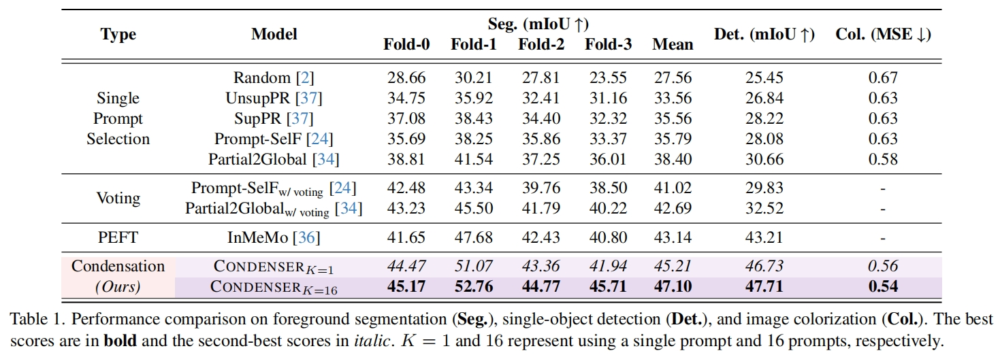

# Embracing Collaboration Over Competition:<br>Condensing Multiple Prompts for Visual In-Context Learning

## 1.Introduction


We devise ${CONDENSER}$, a lightweight external plugin that compresses relevant fine-grained context across multiple prompts. Optimized end-to-end with the backbone and an extra pre-alignment objective, ${CONDENSER}$ ensures stability and accurate integration of contextual cues. 

In the following, we will guide you how to use this repository step by step. 🤗

## 2.Preparation

```
git clone https://anonymous.4open.science/r/VICL-Condenser.git
cd VICL-Condenser
```

### 2.1 Environment Setup

```
conda create -n condenser python=3.8 -y
conda activate condenser
conda install pytorch==1.12.1 torchvision==0.13.1 torchaudio==0.12.1 cudatoolkit=11.6 -c pytorch -c conda-forge
pip install -r requirements.txt
```

### 2.2 Download the image datasets and organize them properly

Download the Pascal-5i Dataset, Pascal VOC 2012 Dataset, Imagenet Dataset, MSCOCO Dataset.

The working directory is expected to be organized as below:

<details><summary>VICL-Condenser/</summary>
<ul>
    <li>Codes/</li>
    <ul>
    	<li>.../</li>
    </ul>
    <li>Data/</li>
    <ul>
    	<li>coco/</li>
    	<li>imagenet/</li>
    	<li>output</li>
    	<ul>
    		<li>logs/</li>
    		<li>visual_examples/</li>
    	</ul>
    	<li>pascal-5i/</li>
    	<li>save_ours_ckpt/</li>
    	<li>splits/</li>
        <ul>
            <li>vqgan/</li>
            <ul>
                <li>last.ckpt</li>
                <li>model.yaml</li>
            </ul>
            <li>checkpoint-1000.pth</li>
        </ul>
    </ul>
</ul>
</details>

Please from the [Visual Prompting](https://github.com/amirbar/visual_prompting) to prepare the model and download the `CVF 1000 epochs` pre-train checkpoint.

**We will use Foreground Segmentation as an example to illustrate the workflow of the code.**

## 3. Prompt Retriever

```
python Codes/tools/feature_extractor_folderwise_segmentation.py vit_large_patch14_clip_224.laion2b features_vit-laion2b_pixel-level val

python Codes/tools/feature_extractor_folderwise_segmentation.py vit_large_patch14_clip_224.laion2b features_vit-laion2b_pixel-level trn

python Codes/tools/calculate_similariity.py features_vit-laion2b_pixel-level val trn
python Codes/tools/calculate_similariity.py features_vit-laion2b_pixel-level trn trn
```

## 4.  Preprocessing Features and Codebook 

```
python Codes/tools/calculate_embedding_feature/calculate_pre_feature_for_query.py
python Codes/tools/calculate_embedding_feature/calculate_pre_feature_for_support.py

python Codes/tools/pre_get_clip_tokens/feature_extractor_folderwise_segmentation.py
```

## 5. Training and Inference

### 5.1 Training 

```
python3 Codes/train_vp_segmentation.py --mode spimg_spmask --output_dir data/output/logs/ --device cuda:0 --base_dir data/pascal-5i/ --batch-size 16 --lr 0.03 --epoch 150 --scheduler cosinewarm --arr a1 --vp-model Prompt --p-eps 1 --ckpt data/weights/checkpoint-1000.pth --vq_ckpt_dir data/weights/vqgan --save_base_dir data/ --simidx 16 --dropout 0.25 --choice Zero --kernel_size 7 --loss_mean 1 --align_q 0 --fold 3
```

### 5.2 Inference

```
python3 Codes/val_vp_segmentation.py --fold 1 --mode spimg_spmask --output_dir data/output/logs/ --device cuda:0 --base_dir data/pascal-5i/ --batch-size 8 --lr 0.03 --epoch 150 --arr a1 --vp-model Prompt --p-eps 1 --ckpt VisualICL/weights/checkpoint-1000.pth --vq_ckpt_dir VisualICL/weights/vqgan --save_base_dir VisualICL/  --simidx 1  --dropout 0.25 --save_model_path SAVE_MODEL_PATH
```

## 6. Performance

 

## 7. Visual Examples


## 8. Acknowledgments

 Part of the code is borrowed from [Visual Prompting](https://github.com/amirbar/visual_prompting), [visual_prompt_retrieval](https://github.com/ZhangYuanhan-AI/visual_prompt_retrieval), [timm](https://github.com/huggingface/pytorch-image-models), [ILM-VP](https://github.com/OPTML-Group/ILM-VP),[InMeMo](https://github.com/Jackieam/InMeMo)


