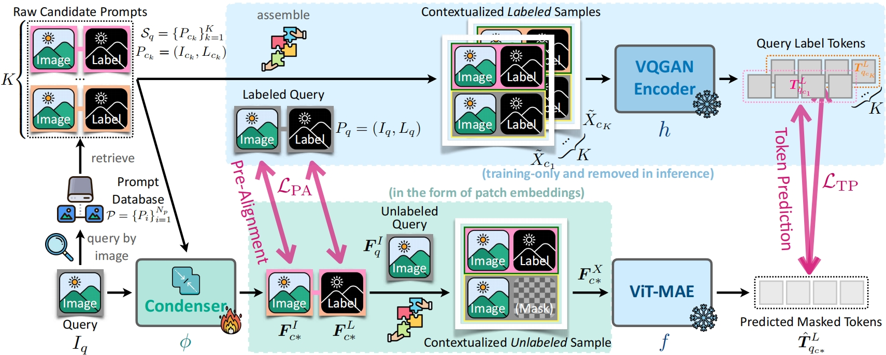
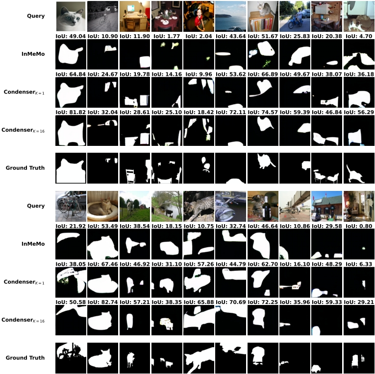

# Embracing Collaboration Over Competition:<br>Condensing Multiple Prompts for Visual In-Context Learning

## 1.Introduction

This repository contains the **PyTorch** implementation of our work at **CVPR 2025**:

> [**Embracing Collaboration Over Competition: Condensing Multiple Prompts for Visual In-Context Learning**](http://arxiv.org/abs/2412.14518).  Jinpeng Wang, Tianci Luo, Yaohua Zha, Yan Feng, Ruisheng Luo, Bin Chen, Tao Dai, Long Chen, Yaowei Wang, Shu-Tao Xia.


We devise ${CONDENSER}$, a lightweight external plugin that compresses relevant fine-grained context across multiple prompts. Optimized end-to-end with the backbone and an extra pre-alignment objective, ${CONDENSER}$ ensures stability and accurate integration of contextual cues. 

In the following, we will guide you how to use this repository step by step. 🤗

## 2.Preparation

```
git clone https://anonymous.4open.science/r/VICL-Condenser.git
cd VICL-Condenser
```

### 2.1 Environment Setup

```
conda create -n condenser python=3.8 -y
conda activate condenser
conda install pytorch==1.12.1 torchvision==0.13.1 torchaudio==0.12.1 cudatoolkit=11.6 -c pytorch -c conda-forge
pip install -r requirements.txt
```

### 2.2 Download the image datasets and organize them properly

Download the Pascal-5i Dataset, Pascal VOC 2012 Dataset, Imagenet Dataset, MSCOCO Dataset.

The working directory is expected to be organized as below:

<details><summary>VICL-Condenser/</summary>
<ul>
    <li>Codes/</li>
    <ul>
    	<li>.../</li>
    </ul>
    <li>Data/</li>
    <ul>
    	<li>coco/</li>
        <ul>
            <li>Coco_Trainlabel</li>
            <li>Coco_Vallabel</li>
            <li>trn2014</li>
            <li>val2014</li>
        </ul>
        <li>imagenet/</li>
        <ul>
            <li>test_data</li>
            <li>test_label</li>
            <li>train_data</li>
            <li>train_label</li>
        </ul>
    	<li>output</li>
    	<ul>
    		<li>logs/</li>
    		<li>visual_examples/</li>
    	</ul>
    	<li>pascal-5i/</li>
    	<li>save_ours_ckpt/</li>
    	<li>splits/</li>
        <li>weights</li>
        <ul>
            <li>vqgan/</li>
            <ul>
                <li>last.ckpt</li>
                <li>model.yaml</li>
            </ul>
            <li>checkpoint-1000.pth</li>
        </ul>
    </ul>
</ul>
</details>

Please from the [Visual Prompting](https://github.com/amirbar/visual_prompting) to prepare the model and download the `CVF 1000 epochs` pre-train checkpoint.

**We will use Foreground Segmentation as an example to illustrate the workflow of the code.**

## 3 Preprocess

### 3.1 Prompt Retriever

We select the best samples through feature space retrieval.

First, we extract features at the pixel-level using CLIP's visual encoder, separately for the val-set and train-set.

```
python Codes/tools/feature_extractor_folderwise_segmentation.py vit_large_patch14_clip_224.laion2b features_vit-laion2b_pixel-level val
python Codes/tools/feature_extractor_folderwise_segmentation.py vit_large_patch14_clip_224.laion2b features_vit-laion2b_pixel-level trn
```

Then, we calculate a similarity matrix using the features, and extract the 50 most similar prompt names.

```
python Codes/tools/calculate_similariity.py features_vit-laion2b_pixel-level val trn
python Codes/tools/calculate_similariity.py features_vit-laion2b_pixel-level trn trn
```

### 3.2  Preprocessing Features

We aim to preprocess the features so that they can be directly used as embeddings for visual prompts and queries.

```
python Codes/tools/calculate_pre_feature_for_query.py
python Codes/tools/calculate_pre_feature_for_support.py
```

## 4. Training and Inference

### 4.1 Training 

```
python3 Codes/train_vp_segmentation.py \
 --mode spimg_spmask \
 --output_dir data/output/logs/ \
 --device cuda:0 \
 --base_dir data/pascal-5i/ \
 --batch-size 16 \
 --lr 0.03 \
 --epoch 150 \
 --scheduler cosinewarm \
 --arr a1 \
 --vp-model Prompt \
 --p-eps 1 \
 --ckpt data/weights/checkpoint-1000.pth \
 --vq_ckpt_dir data/weights/vqgan \
 --save_base_dir data/ \
 --simidx 16 \
 --dropout 0.25 \
 --choice Zero \
 --loss_mean 1 \
 --align_q 0 \
 --fold 3
```
- `<fold>`: fold-id of pascal-5i and coco-5i
- `<simidx>`: number of prompt pairs

1. Replace train_vp_segmentation.py with train_vp_detection.py to train for single object detection.

2. Replace train_vp_segmentation.py with train_vp_coloring.py, then replace --base_dir data/pascal-5i/ with --base_dir data/imagenet/ to train for coloring.

3. Change the value of simidx to determine the number of prompt pairs used during training.

The logs, model checkpoints will be generated under the `data/output/logs/` and `data/save_ours_ckpt/` folders, respectively. 

### 4.2 Inference

We provide the evaluation code for model checkpoints (if exist). 
The test command is as follows:

```
python3 Codes/val_vp_segmentation.py \
 --fold 1\
 --mode spimg_spmask\
 --output_dir data/output/logs/\ 
 --device cuda:0\ 
 --base_dir data/pascal-5i/\ 
 --batch-size 8\
 --lr 0.03\
 --epoch 150\
 --arr a1\
 --vp-model Prompt\
 --p-eps 1\
 --ckpt VisualICL/weights/checkpoint-1000.pth\
 --vq_ckpt_dir VisualICL/weights/vqgan\
 --save_base_dir VisualICL/\
 --simidx 1\
 --dropout 0.25\
 --save_model_path SAVE_MODEL_PATH
```

1. Replace val_vp_segmentation.py with val_vp_detection.py to inference for single object detection.

2. Replace val_vp_segmentation.py with val_vp_coloring.py, then replace --base_dir data/pascal-5i/ with --base_dir data/imagenet/ to inference for coloring.

3. Change the value of simidx to determine the number of prompt pairs used during inference.

## 5. Results

We provide the evaluation results for the corresponding datasets below, along with the Log files and checkpoint files after our evaluation.

<style type="text/css">
.tg  {border-collapse:collapse;border-spacing:0;}
.tg td{border-color:black;border-style:solid;border-width:1px;font-family:Arial, sans-serif;font-size:14px;
  overflow:hidden;padding:10px 5px;word-break:normal;}
.tg th{border-color:black;border-style:solid;border-width:1px;font-family:Arial, sans-serif;font-size:14px;
  font-weight:normal;overflow:hidden;padding:10px 5px;word-break:normal;}
.tg .tg-9wq8{border-color:inherit;text-align:center;vertical-align:middle}
.tg .tg-nrix{text-align:center;vertical-align:middle}
</style>
<table class="tg"><thead>
  <tr>
    <th class="tg-nrix" rowspan="2">Task (Metric)</th>
    <th class="tg-nrix" colspan="2" rowspan="2">Dataset</th>
    <th class="tg-nrix" colspan="3">K=1</th>
    <th class="tg-nrix" colspan="3">K=16</th>
  </tr>
  <tr>
    <th class="tg-nrix">Performance</th>
    <th class="tg-nrix">Log</th>
    <th class="tg-nrix">Checkpoint</th>
    <th class="tg-nrix">Performance</th>
    <th class="tg-nrix">Log</th>
    <th class="tg-nrix">Checkpoint</th>
  </tr></thead>
<tbody>
  <tr>
    <td class="tg-nrix" rowspan="4">Segmentation (mIoU↑)</td>
    <td class="tg-nrix" rowspan="4">Pascal-5i</td>
    <td class="tg-nrix">Folder 0</td>
    <td class="tg-nrix">42.13</td>
    <td class="tg-nrix"><a href="logs/task_segmentation_Zero_align_q0/fold_0/simidx_1">Seg_K_1_Fold_0_Log</a></td>
    <td class="tg-nrix"></td>
    <td class="tg-nrix">45.53</td>
    <td class="tg-nrix"><a href="logs/task_segmentation_Zero_align_q0/fold_0/simidx_16">Seg_K_16_Fold_0_Log</a></td>
    <td class="tg-nrix"></td>
  </tr>
  <tr>
    <td class="tg-nrix">Folder 1</td>
    <td class="tg-nrix">50.31</td>
    <td class="tg-nrix"><a href="logs/task_segmentation_Zero_align_q0/fold_1/simidx_1">Seg_K_1_Fold_1_Log</a></td>
    <td class="tg-nrix"></td>
    <td class="tg-nrix">52.06</td>
    <td class="tg-nrix"><a href="logs/task_segmentation_Zero_align_q0/fold_1/simidx_16">Seg_K_16_Fold_1_Log</a></td>
    <td class="tg-nrix"></td>
  </tr>
  <tr>
    <td class="tg-nrix">Folder 2</td>
    <td class="tg-nrix">42.20</td>
    <td class="tg-nrix"><a href="logs/task_segmentation_Zero_align_q0/fold_2/simidx_1">Seg_K_1_Fold_2_Log</a></td>
    <td class="tg-nrix"></td>
    <td class="tg-nrix">44.33</td>
    <td class="tg-nrix"><a href="logs/task_segmentation_Zero_align_q0/fold_2/simidx_16">Seg_K_16_Fold_2_Log</a></td>
    <td class="tg-nrix"></td>
  </tr>
  <tr>
    <td class="tg-nrix">Folder 3</td>
    <td class="tg-nrix">41.90</td>
    <td class="tg-nrix"><a href="logs/task_segmentation_Zero_align_q0/fold_3/simidx_1">Seg_K_1_Fold_3_Log</a></td>
    <td class="tg-nrix"></td>
    <td class="tg-nrix">44.58</td>
    <td class="tg-nrix"><a href="logs/task_segmentation_Zero_align_q0/fold_3/simidx_16">Seg_K_16_Fold_3_Log</a></td>
    <td class="tg-nrix"></td>
  </tr>
  <tr>
    <td class="tg-nrix">Detection (mIoU↑)</td>
    <td class="tg-nrix" colspan="2">Pascal VOC 2012</td>
    <td class="tg-nrix">43.22</td>
    <td class="tg-nrix"><a href="logs/task_detection_Zero_align_q0/fold_0/simidx_1">Det_K_1_Log</a></td>
    <td class="tg-nrix"></td>
    <td class="tg-nrix">44.64</td>
    <td class="tg-nrix"><a href="logs/task_detection_Zero_align_q0/fold_0/simidx_16">Det_K_16_Log</a></td>
    <td class="tg-nrix"></td>
  </tr>
  <tr>
    <td class="tg-nrix">Coloring (MSE↓)</td>
    <td class="tg-nrix" colspan="2">ImageNet-1K</td>
    <td class="tg-nrix">0.56</td>
    <td class="tg-nrix"><a href="logs/task_coloring_Zero_align_q0/fold_0/simidx_1">Col_K_1_Log</a></td>
    <td class="tg-nrix"></td>
    <td class="tg-nrix">0.54</td>
    <td class="tg-nrix"><a href="logs/task_coloring_Zero_align_q0/fold_0/simidx_16">Col_K_16_Log</td>
    <td class="tg-nrix"></td>
  </tr>
</tbody></table>

We have also open-sourced the experiment logs and checkpoints for the domain adaptation experiments. The experiments were pre-trained on Coco-5i and tested on Pascal-5i.

<style type="text/css">
.tg  {border-collapse:collapse;border-spacing:0;}
.tg td{border-color:black;border-style:solid;border-width:1px;font-family:Arial, sans-serif;font-size:14px;
  overflow:hidden;padding:10px 5px;word-break:normal;}
.tg th{border-color:black;border-style:solid;border-width:1px;font-family:Arial, sans-serif;font-size:14px;
  font-weight:normal;overflow:hidden;padding:10px 5px;word-break:normal;}
.tg .tg-9wq8{border-color:inherit;text-align:center;vertical-align:middle}
.tg .tg-nrix{text-align:center;vertical-align:middle}
</style>
<table class="tg"><thead>
  <tr>
    <th class="tg-nrix" rowspan="2">Task (Metric)</th>
    <th class="tg-nrix" colspan="2" rowspan="2">Dataset</th>
    <th class="tg-nrix" colspan="3">K=1</th>
    <th class="tg-nrix" colspan="3">K=16</th>
  </tr>
  <tr>
    <th class="tg-nrix">Performance</th>
    <th class="tg-nrix">Log</th>
    <th class="tg-nrix">Checkpoint</th>
    <th class="tg-nrix">Performance</th>
    <th class="tg-nrix">Log</th>
    <th class="tg-nrix">Checkpoint</th>
  </tr></thead>
<tbody>
  <tr>
    <td class="tg-nrix" rowspan="4">Segmentation (mIoU↑)</td>
    <td class="tg-nrix" rowspan="4">Coco-5i</td>
    <td class="tg-nrix">Folder 0</td>
    <td class="tg-nrix">40.39</td>
    <td class="tg-nrix"><a href="logs/task_segmentation_coco_Zero_G_copy_another_False_G_only_div_False_align_s1_align_q0_loss_mean1/fold_0/simidx_1">Coco_K_1_Fold_0_Log</a></td>
    <td class="tg-nrix"></td>
    <td class="tg-nrix">40.37</td>
    <td class="tg-nrix"><a href="logs/task_segmentation_coco_Zero_G_copy_another_False_G_only_div_False_align_s1_align_q0_loss_mean1/fold_0/simidx_16">Coco_K_16_Fold_0_Log</a></td>
    <td class="tg-nrix"></td>
  </tr>
  <tr>
    <td class="tg-nrix">Folder 1</td>
    <td class="tg-nrix">44.54</td>
    <td class="tg-nrix"><a href="logs/task_segmentation_coco_Zero_G_copy_another_False_G_only_div_False_align_s1_align_q0_loss_mean1/fold_1/simidx_1">Coco_K_1_Fold_1_Log</a></a></td>
    <td class="tg-nrix"></td>
    <td class="tg-nrix">44.85</td>
    <td class="tg-nrix"><a href="logs/task_segmentation_coco_Zero_G_copy_another_False_G_only_div_False_align_s1_align_q0_loss_mean1/fold_1/simidx_16">Coco_K_16_Fold_1_Log</a></td>
    <td class="tg-nrix"></td>
  </tr>
  <tr>
    <td class="tg-nrix">Folder 2</td>
    <td class="tg-nrix">40.23</td>
    <td class="tg-nrix"><a href="logs/task_segmentation_coco_Zero_G_copy_another_False_G_only_div_False_align_s1_align_q0_loss_mean1/fold_2/simidx_1">Coco_K_1_Fold_2_Log</a></td>
    <td class="tg-nrix"></td>
    <td class="tg-nrix">41.03</td>
    <td class="tg-nrix"><a href="logs/task_segmentation_coco_Zero_G_copy_another_False_G_only_div_False_align_s1_align_q0_loss_mean1/fold_2/simidx_16">Coco_K_16_Fold_2_Log</a></td>
    <td class="tg-nrix"></td>
  </tr>
  <tr>
    <td class="tg-nrix">Folder 3</td>
    <td class="tg-nrix">36.33</td>
    <td class="tg-nrix"><a href="logs/task_segmentation_coco_Zero_G_copy_another_False_G_only_div_False_align_s1_align_q0_loss_mean1/fold_3/simidx_1">Coco_K_1_Fold_3_Log</a></td>
    <td class="tg-nrix"></td>
    <td class="tg-nrix">35.84</td>
    <td class="tg-nrix"><a href="logs/task_segmentation_coco_Zero_G_copy_another_False_G_only_div_False_align_s1_align_q0_loss_mean1/fold_3/simidx_16">Coco_K_16_Fold_3_Log</a></td>
    <td class="tg-nrix"></td>
  </tr>
</tbody></table>


## 6. Visual Examples

We have provided visualized results for some test cases to help readers with an intuitive understanding.



## 7. Acknowledgments

This code is based on our previous work [InMeMo](https://github.com/Jackieam/InMeMo). 

We are also grateful for other teams for open-sourcing codes that inspire our work, including [Visual Prompting](https://github.com/amirbar/visual_prompting), [visual_prompt_retrieval](https://github.com/ZhangYuanhan-AI/visual_prompt_retrieval), [timm](https://github.com/huggingface/pytorch-image-models), [ILM-VP](https://github.com/OPTML-Group/ILM-VP).

## 8. Contact

If you have any question, you can raise an issue or email Jinpeng Wang (wjp20@mails.tsinghua.edu.cn). We will reply you soon.


